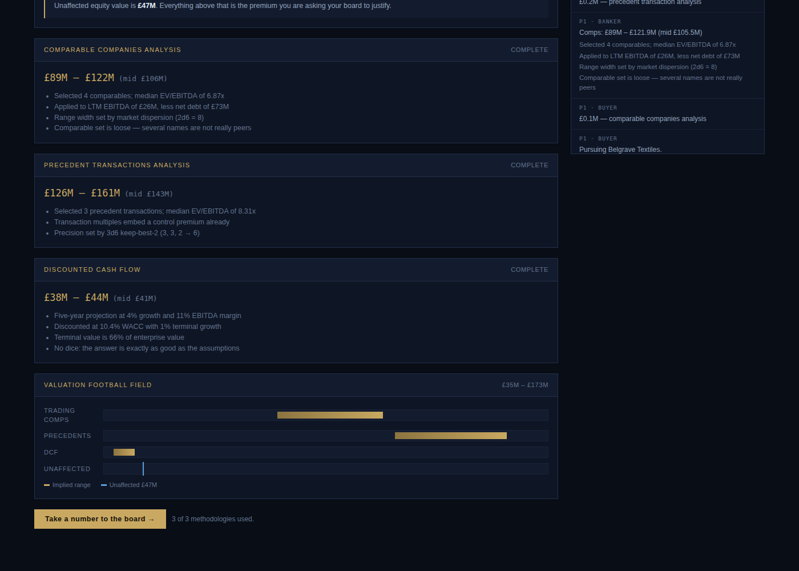
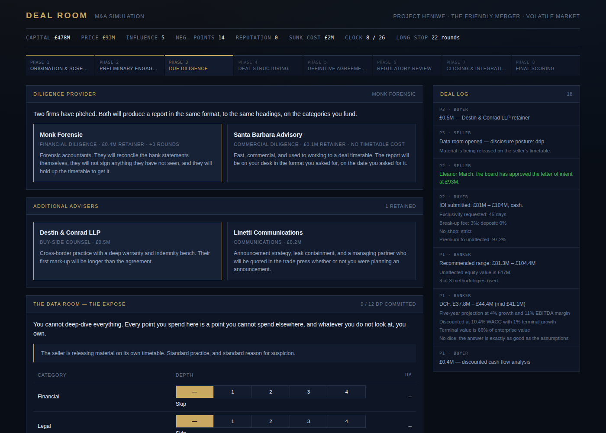
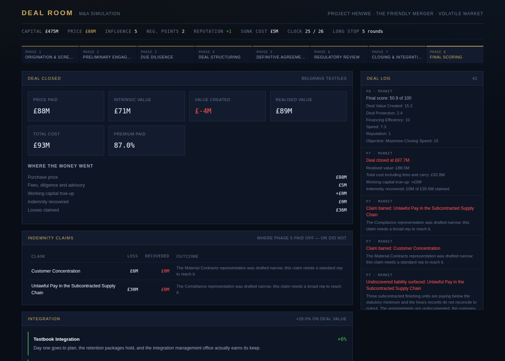

# Deal Room

A playable implementation of the M&A simulation specified in
[`GAME_DESIGN_DOCUMENT.md`](./GAME_DESIGN_DOCUMENT.md).

You play the Buyer through all seven phases of a transaction — screening the
market, valuing a target, negotiating an LOI, spending a finite diligence
budget, structuring and financing the deal, negotiating the definitive
agreement, surviving antitrust review, and then living with every term you
agreed to. The Seller, Banker and Regulator are played by the engine, and each
is pursuing a private objective you never get to see.

The design principle the whole thing is built around: **every term you
negotiate has a mechanical consequence later.** A representation you let the
seller draft narrowly is the reason a $382M claim is barred two years after
closing. A MAC carve-out you failed to strip is the reason you cannot walk when
the target loses its largest customer. Nothing is flavour text.



## Running it

```bash
npm install     # typescript and @types/node only; the game itself has no dependencies
npm start       # builds, then serves at http://localhost:8080 (PORT=8081 to change)
npm test        # 24 tests covering the rules engine
npm run balance # plays 360 games and reports whether skill is rewarded
```

There is no bundler and no framework. `tsc` emits ES modules that the browser
loads directly.

## How a game goes

**Phase 1 — Origination.** Five targets are face up. Screening one costs
$2.5M and opens its financials. Then you pay for valuation work: comparable
companies is cheap and imprecise (the range width comes off 2d6), precedent
transactions is slower and tighter (3d6 keep best 2), and a DCF has no dice at
all — the answer is exactly as good as your assumptions.

The banker's recommended range runs optimistic, and it runs *most* optimistic
on the targets carrying the heaviest undisclosed risk, because nobody can see
the skeletons yet. The gap between the range and the truth is the hidden risk.

**Phase 2 — Engagement.** You submit an indication of interest and negotiate
the LOI over at most three rounds: price, consideration, exclusivity, break-up
fee, no-shop, deposit. Let the rounds run out and the open terms default to
market standard, which is worse for both sides than any negotiated outcome.

**Phase 3 — Diligence.** Twelve Diligence Points across eight categories. One
point opens the top file, three opens the whole category, four buys an expert
read that lets you argue the top of the range on what you find. You cannot
cover everything, and whatever you do not look at, you own. If the seller has
buried the bad material, breadth finds nothing and only depth works.

**Phase 4 — Structuring.** Five transaction structures with real consequences
for liability, speed and consents; a seven-tranche financing stack constrained
by your acquirer's actual balance sheet; four tax structures the seller will
price into the deal.

**Phase 5 — Definitive agreement.** You have Negotiation Points of stamina and
four fronts to spend them on: representations, the MAC definition,
indemnification, and closing conditions. Spread them and you win nothing
outright; concentrate them and you concede whatever you left bare.



**Phase 6 — Regulatory.** An HHI calculation against the 2500/200 screen. How
you define the market decides your share, and your share decides whether the
presumption runs against you. Second Requests cost money and rounds; a
challenge goes to a precedent draw.

**Phase 7 — Closing and integration.** Events land between signing and
closing. If one is bad enough you can assert a Material Adverse Effect — and
the clause you negotiated in Phase 5 decides whether that is a strong position
or buyer's remorse with a specific performance judgment attached. Then the
integration cards land, the undiscovered liabilities surface, and the
indemnity terms decide how much of it you recover.



## Does it reward skill?

`npm run balance` plays 120 games per strategy across all five scenarios and
reports:

| Strategy | Mean score | Deals closed | Of those, value-creating |
|---|---|---|---|
| Reckless — bid the top of the range, 2 DP of diligence, no negotiation | 3.4 | 94% | 2% |
| Competent — full valuation, spread diligence, balanced push | 21.9 | 100% | 28% |
| Disciplined — bid low, deep diligence, heavy indemnity push, walk when it does not work | 47.0 | 100% | 59% |

Careless buyers close almost every deal and create value on 2% of them, which
is roughly the point.

## Architecture

```
src/engine/          Pure TypeScript, zero runtime dependencies, fully deterministic
  rng.ts             Seeded PRNG — (seed, actions) always reproduces the same game
  types.ts           Domain types, annotated with the GDD section each implements
  content/           Cards and data: targets, data room, events, precedents, scenarios
  valuation.ts       Comps, precedents, DCF, accretion/dilution, LBO returns
  diligence.ts       Data room construction, disclosure strategy, findings
  negotiation.ts     Leverage, BATNA, concessions, term resolution
  structuring.ts     Structures, financing stack, tax treatment
  agreement.ts       R&W scope, MAC carve-outs, indemnity terms, MAC assessment
  regulatory.ts      HHI, review intensity, remedies, litigation
  closing.ts         Interim events, MAC disputes, integration, indemnity claims
  scoring.ts         Role scoring per GDD §11
  ai.ts              Seller, banker, regulator and competing bidders
  game.ts            Phase state machine and action dispatch
src/ui/              Browser UI — hand-rolled DOM, no framework
test/                Rules tests and full-playthrough regression
```

The engine never calls `Math.random()`. Every game is a pure function of its
seed and the actions taken, which is what makes the replay claim in GDD §16.1
achievable and what makes the tests meaningful.

## What is implemented, and what is not

**Implemented:** all seven phases; the four core roles with AI for three of
them; 41 data room cards, 8 targets, 4 acquirers, 10 interim events, 12
integration cards, 12 precedent cards, 12 private objectives, 5 scenarios;
comps/precedent/DCF valuation; the full financing stack; five deal structures
and four tax structures; representation scope negotiation; the 13 MAC
carve-outs and the disproportionate impact exception; the complete
indemnification model (cap, basket type, survival, escrow, sandbagging, sole
remedy, specific indemnities, R&W insurance); HSR review with HHI and remedies;
MAC invocation; integration and post-closing claims; role scoring with private
objectives.

**Not implemented from the design document:** the expansion roles (Activist,
Lender, Target CEO, Outside Counsel) and team play; hostile bids and the
defence mechanism cards (the card data exists in `content/precedents.ts` but no
phase plays them); real-time multiplayer and the campaign mode; CFIUS and the
multi-jurisdictional regulatory module; the physical component set.

## Licence

Unlicensed working prototype.
